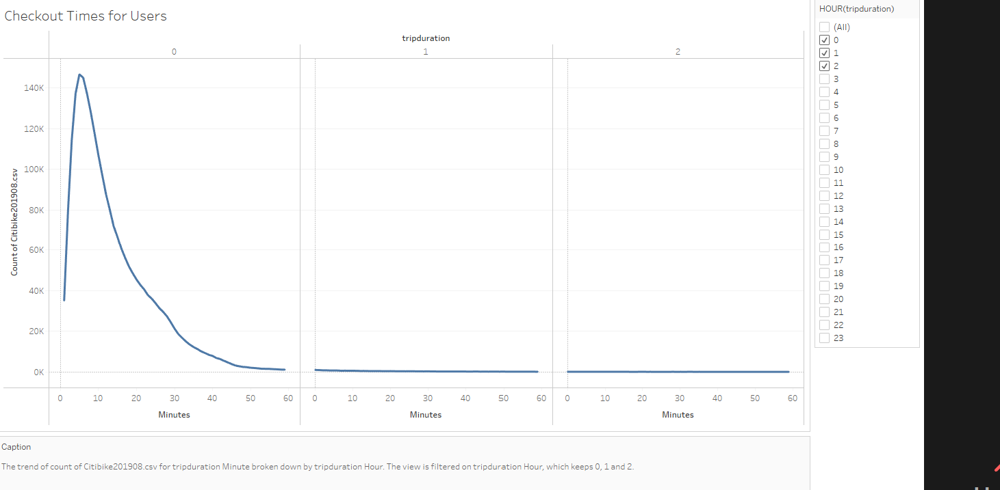

# NYC Citibike with Tableau
### Tableau URL for Analysis
https://public.tableau.com/app/profile/dennis.smith3793/viz/Bike_Challenge_16472876885490/MoreCitiBikeStory?publish=yes
## Purpose:
- Import data into Tableau.
- Create and style worksheets, dashboards, and stories in Tableau.
- Use Tableau worksheets to display data in a professional way.
- Portray data accurately using Tableau dashboards.
## Overview of the statistical analysis:
Des Moines requested data for a business proposal. August 2019 Citibike data from NYC was reviewed by looking at geographical data as well as data disaggregated by user types and genders to determine if it would be a good investment for Des Moines. Other data points include usage durations, peak usage times, and the key target market.

## Link to Tableau Story:
Tableau Story

### Cleaning the Data:
Jupyter Notebook was used to change the trip duration data to a datetime field. 

### Results of the NYC Citibikes Analysis:
For NYC, there were some interesting geographical areas of interest. Some trips were outside the main city center. Other areas followed the along the river. Future analysis would need to include a geographical review.

1. Checkout Times for All Users
Checkout Times for All Users The Citibikes usage reaches a top of 3000 minutes per user.

2. Checkout Times by Gender
Checkout Times by Gender Males are significantly higher users than others. 

3. Trips (Weekday per Hour)
Trips (Weekday per Hour) 6-10 am and 5-8 PM are peak riding hours during the weekday and 5 am to 10 pm on the weekends. 

4. Trips by Gender (Weekday per Hour)
Trips by Gender (Weekday per Hour) Males are high users during the peak hours. 

5. Trips by Gender and User Type (Weekday per Hour)
Trips by Gender and User Type (Weekday per Hour) Males subscribers are the highest users followed by female subscribers. 

6. Trip Duration By age
Trip Duration by age shows that the 21-25 range uses the service the most. It also show that there is an error in the data as it relates to customers.

7. Trips by DOW and Gender
Thursday seems to be the busiest day of the week. Bike_Trips for each Starttime Weekday.  Color shows details about Gender. The data is filtered on End Station Name and Usertype. The End Station Name filter keeps 10 of 1,212 members. The Usertype filter keeps Customer and Subscriber.

## Summary:
- Bike Repairs for 1/3 of the Citibikes need to be done during non-peak hours around 1-5 am.
- Male subscribers are the highest users and follow the traditional high use times of travel to and from work.
- Target market should be males needing transportation to work and weekend activities and push for subscribing to the services.
## Additional Analysis:
For NYC, there were some interesting geographical areas of interest. Some trips were outside the main city center. Other areas followed the along the river. Future analysis would need to include a geographical review.

1. Ride Starting Locations by Gender
Ride Starting Locations by Gender Males are more likely to start a trip farther than the main city center of NYC than others. 

2. Ride Ending Locations by Gender
Ride Ending Locations by Gender Males are more likely end a trip farther than the main city center of NYC than others. 
